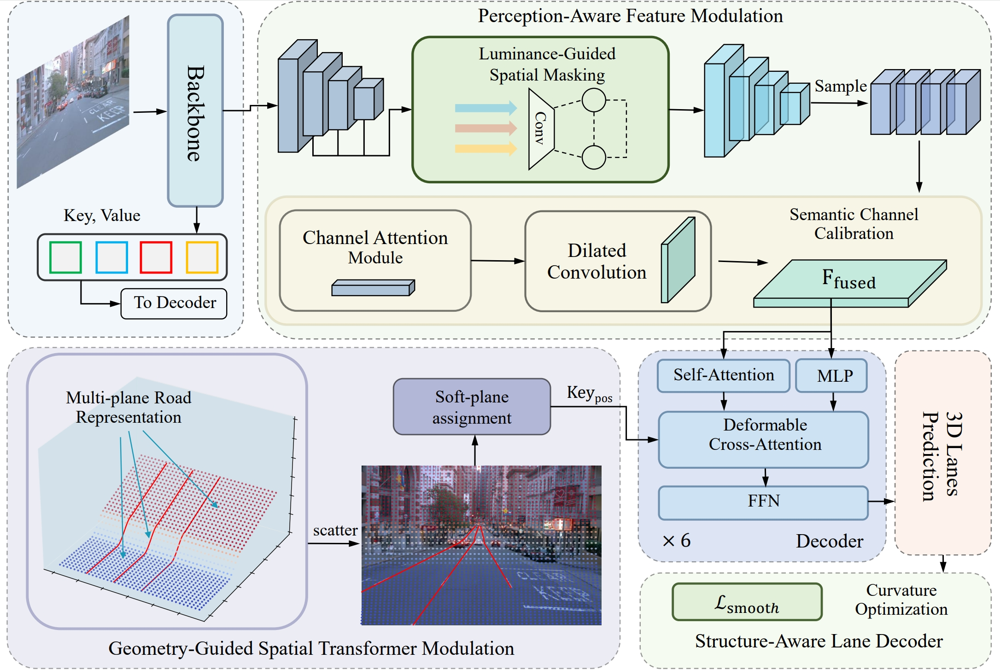

# Monocular 3D Lane Detection with Geometry-Guided Transformation and Contextual Enhancement

## 🗺️ Overview

> **Monocular 3D Lane Detection with Geometry-Guided Transformation and Contextual Enhancement**

GeoCNet, a BEV-free framework that directly estimates 3D lanes in the perspective domain


## 🛠️ Environments

We recommend using **Python 3.8** and **Pytorch 1.11.0+cu113** for full compatibility. Follow the steps below to set up your environment:

```bash
# Step 1: Navigate to the project root
cd GeoCNet

# Step 2: Create a new virtual environment (Python 3.8)
conda create -n geocnet python=3.8 -y
conda activate geocnet

# Step 3: Install PyTorch with CUDA 11.3 support
pip install torch==1.11.0+cu113 torchvision==0.12.0+cu113 torchaudio==0.11.0 --extra-index-url https://download.pytorch.org/whl/cu113

# Step 4: Install other required packages
pip install -r requirements.txt

# Step 5: Install MMCV (compatible with PyTorch 1.11.0 + CUDA 11.3)
git clone https://github.com/open-mmlab/mmcv.git
cd mmcv && git checkout v1.5.0
FORCE_CUDA=1 MMCV_WITH_OPS=1 python -m pip install .

# Step 6: Install other mm packages
pip install mmdet==2.24.0
pip install mmdet3d==1.0.0rc3.
```
## 📂 Data Preparation

This project supports two datasets: **OpenLane** and **Apollo 3D Lane Synthetic**. Please follow the official instructions from their respective repositories to download and prepare the data.

### 🔹 OpenLane Dataset

Refer to the instructions provided by [PersFormer](https://github.com/OpenDriveLab/PersFormer_3DLane#dataset)


### 🔹 Apollo Synthetic 3D Lane Dataset

Refer to the instructions provided by [Pytorch_Generalized_3D_Lane_Detection](https://github.com/yuliangguo/Pytorch_Generalized_3D_Lane_Detection#data-preparation)

## 🙏 Acknowledgment

This project is built upon and inspired by the following excellent works:

- [LATR](https://github.com/JMoonr/LATR)
- [PersFormer](https://github.com/OpenDriveLab/PersFormer_3DLane)
- [Gen-LaneNet](https://github.com/yuliangguo/Pytorch_Generalized_3D_Lane_Detection)
- [MMDetection3D](https://github.com/open-mmlab/mmdetection3d)

